<div align="center">

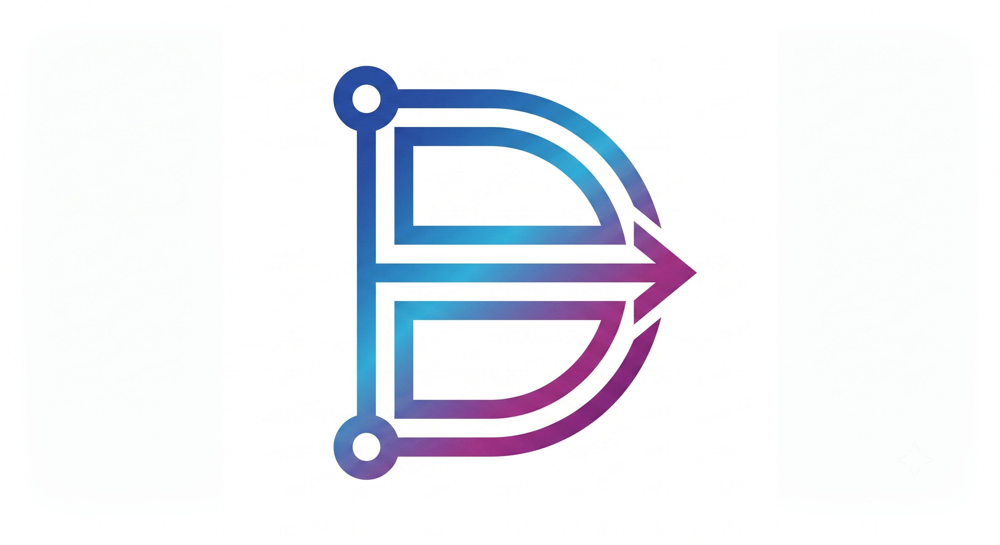

# Diagramo

### AI-Powered Collaborative Whiteboard for Modern Teams

Design. Collaborate. Generate. Summarize.

Real-time collaborative whiteboard powered by Google Gemini AI.

<br/>


</div>

---

# ✨ Overview

Diagramo is an AI-powered collaborative whiteboard built for developers, students, designers, and teams.

Create diagrams together in real time, communicate through integrated chat, generate complete diagrams using AI prompts, and instantly convert an entire whiteboard into beautifully formatted Markdown summaries.

Whether you're designing ER diagrams, flowcharts, system architecture, UML diagrams, or brainstorming ideas, Diagramo provides a fast and intelligent collaborative workspace.

---

# 🚀 Features

## 🎨 Whiteboard

- Freehand Drawing
- Rectangle
- Circle
- Arrow
- Straight Line
- Text Tool
- Color Picker
- Stroke Width
- Undo / Redo
- Download Canvas
- Theme Support

---

## 🤝 Collaboration

- Real-time Whiteboard
- Multi-user Collaboration
- Live Cursor Synchronization
- Room Based Sessions
- Online Users Panel
- Real-time Chat

---

## 🤖 AI Features

- Generate Complete Diagrams from Natural Language
- AI Generated Flowcharts
- ER Diagram Generation
- UML Diagram Generation
- Architecture Diagram Generation
- Whiteboard Summarization
- Beautiful Markdown Rendering
- Generation History
- Summary History

---

## 👤 User Features

- Authentication
- Protected Routes
- Dashboard
- Recent Rooms
- My Rooms
- User Profile
- Leave Room

---
# 🖼 Screenshots

## 🌐 Landing Page

<p align="center">
  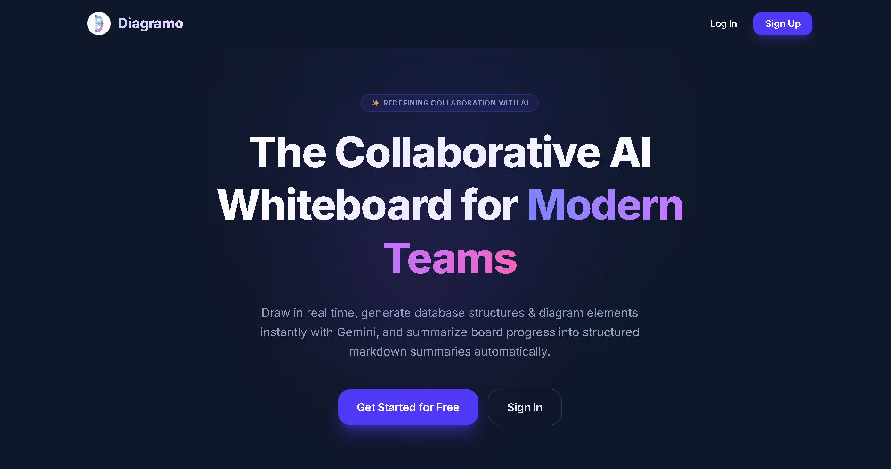
</p>

<p align="center">
  
</p>

<p align="center">
  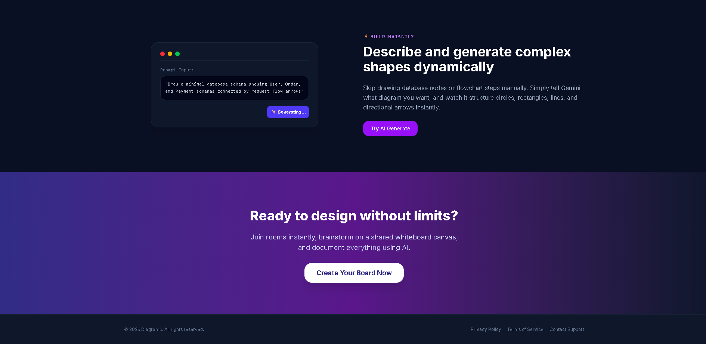
</p>

---

## 🔐 Authentication

### Login

<p align="center">
  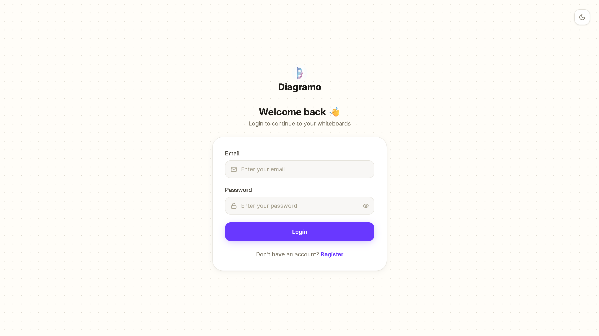
</p>

### Register

<p align="center">
  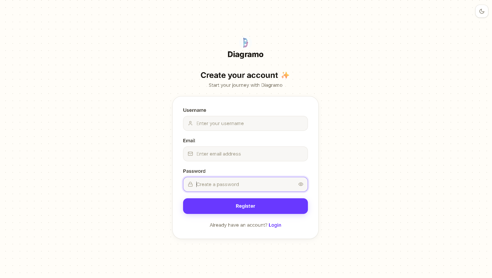
</p>

---

## 📊 Dashboard

<p align="center">
  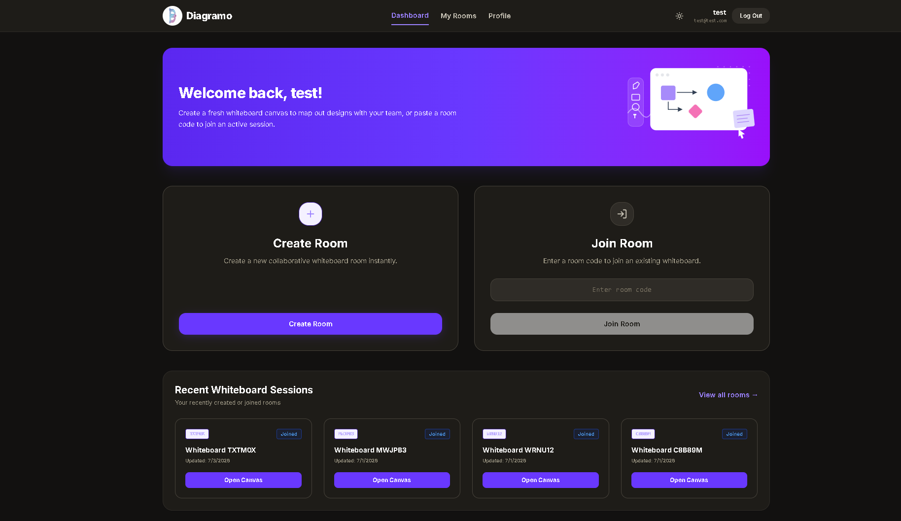
</p>

---

## 📁 My Rooms

<p align="center">
  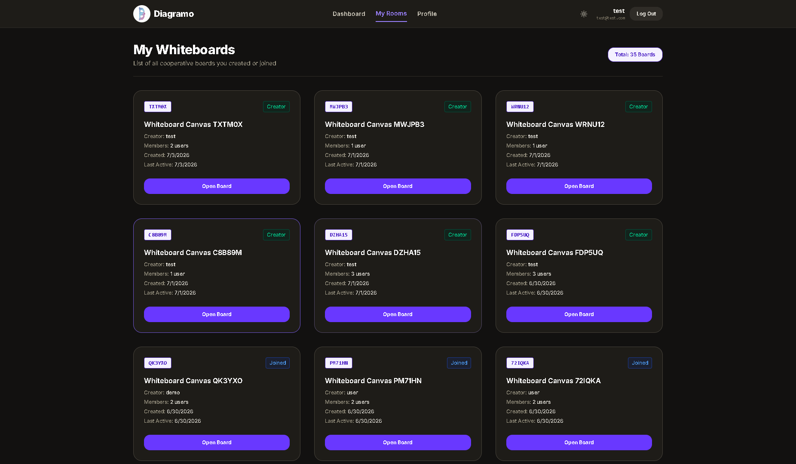
</p>

---

## 👤 Profile

<p align="center">
  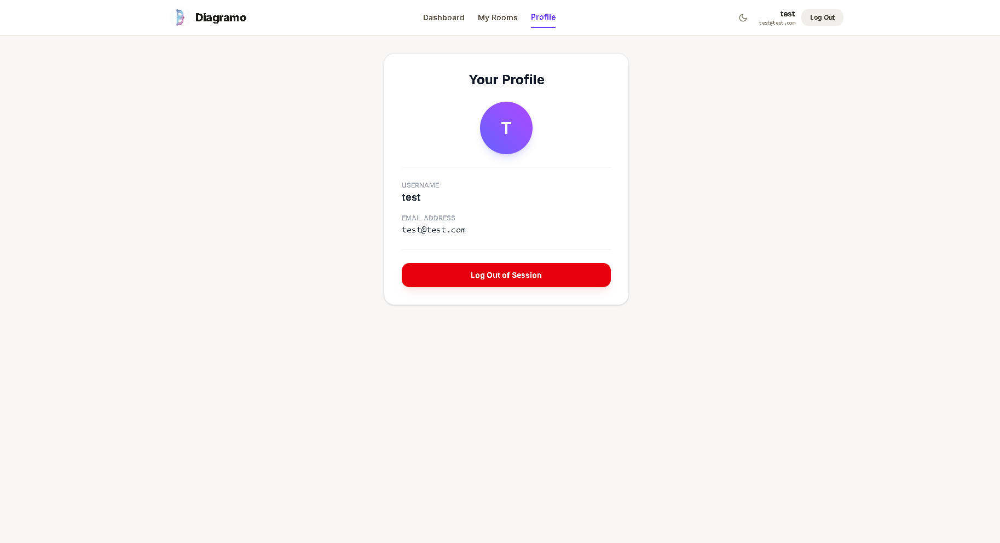
</p>

---

## 🎨 Collaborative Whiteboard (Light Theme)

<p align="center">
  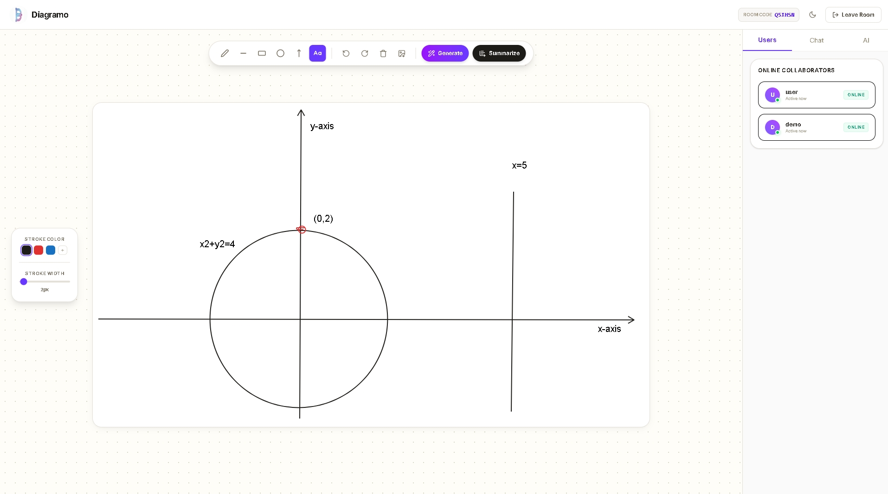
</p>

---

## 🌙 Collaborative Whiteboard (Dark Theme)

<p align="center">
  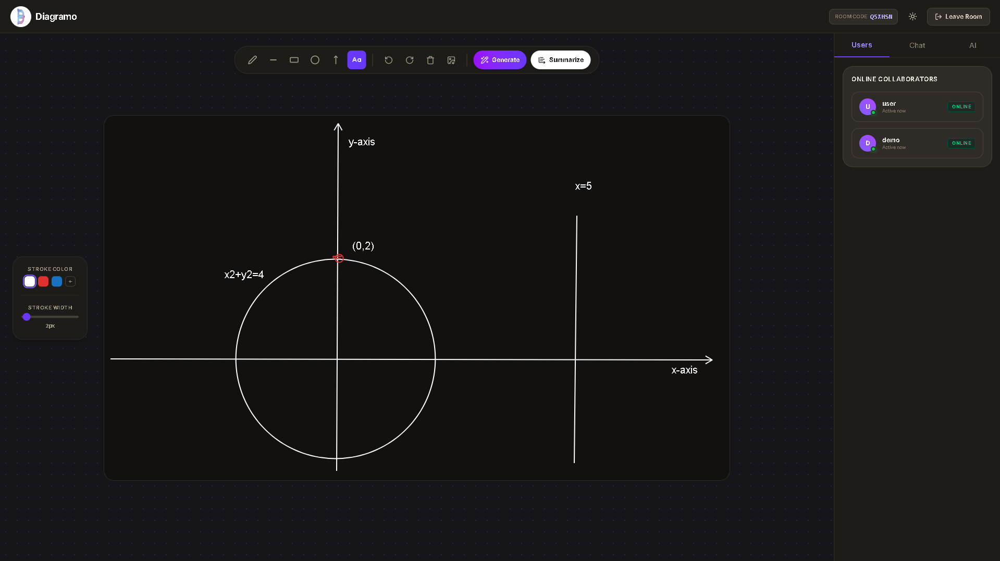
</p>

---

## 🤖 AI Diagram Generation

<p align="center">
  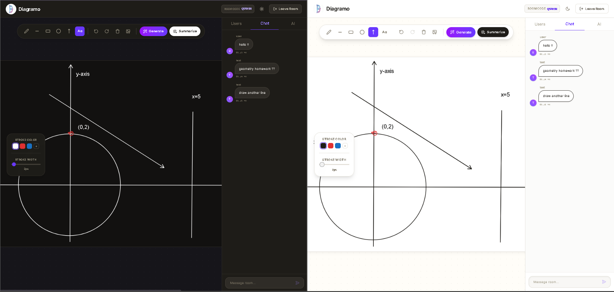
</p>

---

## 📝 AI Summary

<p align="center">
  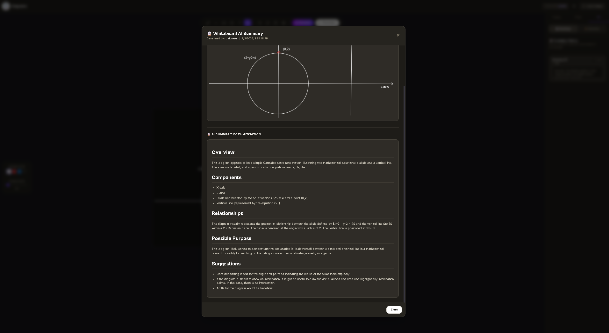
</p>

---

## 💬 Real-Time Chat

<p align="center">
  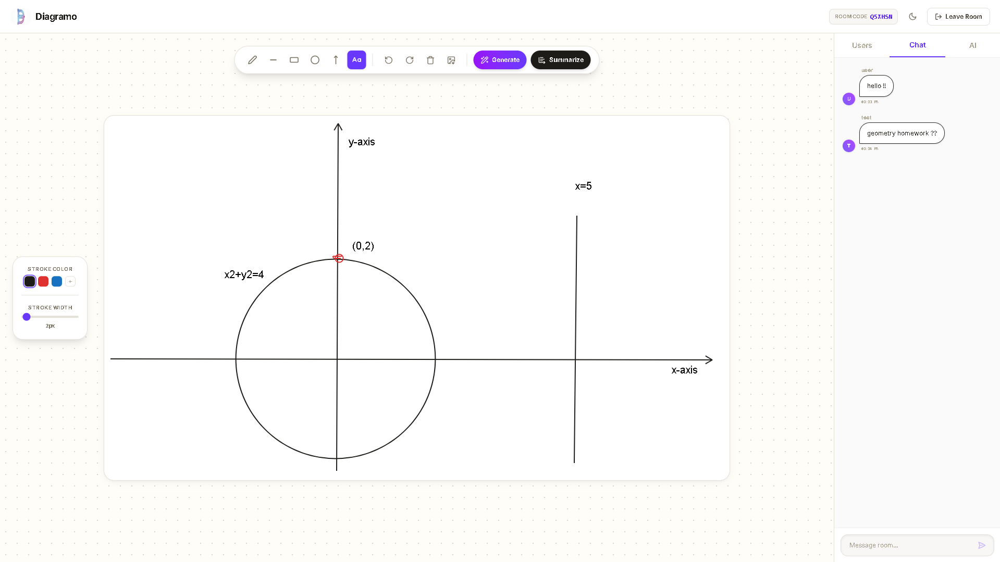
</p>

---

## 🤝 Multi-User Collaboration

<p align="center">
  
</p>


# 🛠 Tech Stack

## Frontend

- React
- Vite
- TailwindCSS
- React Router
- Context API
- React Markdown
- Lucide React
- Rough.js

---

## Backend

- Node.js
- Express.js
- MongoDB
- Mongoose
- JWT Authentication
- Socket.IO
- Cloudinary

---

## AI

- Google Gemini API

---

# 🏗 Architecture

## Backend (MVC + Service Layer)

```
backend/
│
├── config/
├── controllers/
├── middlewares/
├── models/
├── routes/
├── services/
├── app.js
└── server.js
```

Responsibilities

- Controllers → Handle HTTP Requests
- Services → Business Logic
- Models → MongoDB Schemas
- Routes → API Endpoints
- Middleware → Authentication & Validation

---

## Frontend (Feature-Based 4-Layer Architecture)

```
frontend/src
│
├── components/
├── features/
│   ├── auth/
│   ├── dashboard/
│   ├── room/
│   ├── whiteboard/
│   ├── chat/
│   ├── ai/
│   └── home/
│
├── utils/
├── App.jsx
└── app.routes.jsx
```

Each feature follows

```
feature
│
├── components
├── hooks
├── services
└── Context
```

This architecture keeps features modular, scalable, and easy to maintain.

---

# 📂 Folder Structure

```
Diagramo
│
├── assets
│
├── backend
│   ├── config
│   ├── controllers
│   ├── middlewares
│   ├── models
│   ├── routes
│   ├── services
│   ├── app.js
│   └── server.js
│
├── frontend
│   ├── src
│   │
│   ├── components
│   ├── features
│   ├── utils
│   ├── App.jsx
│   └── app.routes.jsx
│
└── README.md
```

---

# ⚙ Environment Variables

## Backend

Create a `.env` file inside the `backend` directory.

```env
PORT=3000

MONGO_URI=

JWT_SECRET=

GEMINI_API_KEY=

CLOUDINARY_CLOUD_NAME=

CLOUDINARY_API_KEY=

CLOUDINARY_API_SECRET=
```

---

# 📦 Installation

Clone the repository

```bash
git clone https://github.com/YOUR_USERNAME/Diagramo.git
```

```bash
cd Diagramo
```

---

### Backend

```bash
cd backend
npm install
```

Create

```
backend/.env
```

Start server

```bash
npm run dev
```

---

### Frontend

```bash
cd frontend
npm install
```

Start Vite

```bash
npm run dev
```

---

# 🔥 Running the Application

Backend

```
http://localhost:3000
```

Frontend

```
http://localhost:5173
```

---

# 🌟 Highlights

- AI-assisted whiteboard
- Real-time collaboration
- Feature-based frontend architecture
- MVC backend architecture
- Clean scalable codebase
- Modern responsive UI
- Dark & Light Theme
- Markdown rendering
- Socket.IO synchronization
- Google Gemini Integration

---

# 📈 Future Improvements

- Version History
- Board Templates
- Image Upload
- Voice Collaboration
- Sticky Notes
- Export to PDF
- Comments
- Board Permissions
- Cursor Presence
- Infinite Canvas
- Board Sharing

---

# 🤝 Contributing

Contributions, feature requests, and suggestions are welcome.

Feel free to fork the repository and submit a pull request.

---

# 📄 License

This project is licensed under the MIT License.

---

<div align="center">

### Built with ❤️ using React, Node.js, MongoDB, Socket.IO & Google Gemini

**Diagramo © 2026**

</div>